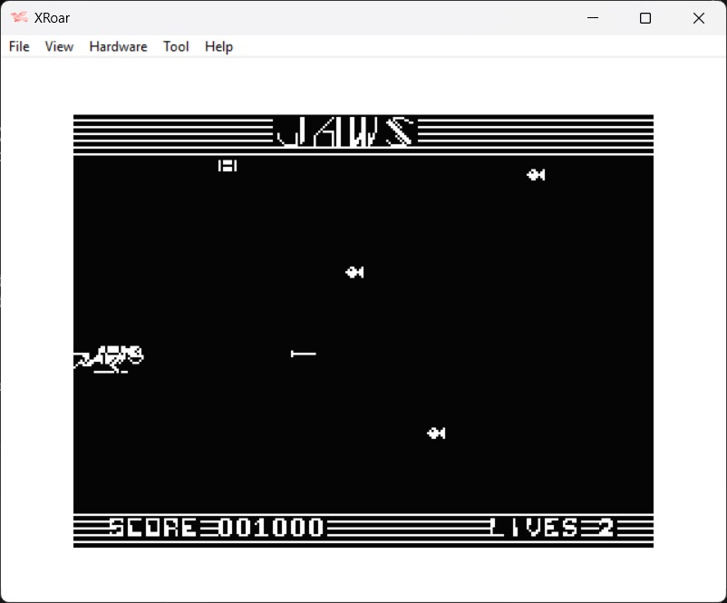

This is a 6809 assembly language one player arcade game for the Dragon 32.  The object of the game is to fire spears at the fish that is moving towards the diver. Hitting the two vertically moving fish will gain extra points and delay the shark appearing.
Press ENTER to fire the spear, the UP arrow key to control the diver.  When the shark appears, press ENTER to drop the barrel in an attempt to kill the shark.

The program was written by Steve Gathercole and originally published in the June 1986 edition of Dragon User Magazine.

| File | Description |
| --- | --- |
| build.bat |  A windows batch file to assemble and run the program file.  1.  Set the path to asm6809 and XROAR (change as required)    2.  Assemble the code file using asm6809   3.  Run the resulting Jaws.bin file in XROAR |
| Jaws.asm | The assembly code file |
| Jaws.cas | The assembled game file. |

Please note, asm6809 and XROAR(and associated ROMS) are not included, but can be downloaded from the following locations: 
https://www.6809.org.uk/xroar/   https://www.6809.org.uk/asm6809/

To run the game without assembling the code file:
+ Download Jaws.cas to your device
+ Open a browser and paste the following URL:  https://www.6809.org.uk/xroar/online/
+ Under the emulation screen, click the File tab
+ Click the load button, and select the downloaded Jaws.cas
+ In the emulation screen, type the following: CLOADM:EXEC   <press enter>
                

